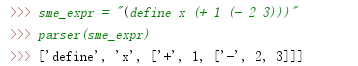

## 0.介绍
本文所要实现的是一个简化的Scheme交互式解释器，简称sme, sme所要实现的功能较为简单，是Scheme的一个小子集。[这里](https://www.ibm.com/developerworks/cn/linux/l-schm/index1.html)有两篇文章详细的介绍了scheme。

什么是解释器？ 解释器是将元语言代码翻译成其他高级语言的代码。
解释器主要由以下几个部分组成：
1.	词法分析器：词法分析器读入源程序中的字符序列，将他们组织为具有词法含义的词素，生成并输出代表这些词素的词法单元(Token)。
2.	语法分析器：语法分析器根据词法单元，以语法分析树的形式构建表达式，最终形成一颗抽象的语法树(abstract syntax tree)，这是一种表示了层次化的结构。
3.  树遍历求值

一个交互式解释器的基本组件主要是:
* Parser：\
    &emsp;&emsp;解析源程序，并生成解释器可以理解的中间结构.
* Eval:\
    &emsp;&emsp;执行解析阶段得到的中间结构然后得到运行结果。这部分包含作用域和语法树遍历等。
* Print:\
    &emsp;&emsp;打印每个输入的执行结果.
    
## 1. Parser
这部分主要是将用户输入即sme源代码字符串转化为我们解释器内部的Python表示，我们会根据以下规则将sme代码解析为相应Python对象：

| 例子  | sme数据类型  |  Python表示  |
| :------------: |:---------------:| :-----:|
| sme>> 1     | Number | int ,float |
| sme>> x      | Symbol        |   str |
| sme>> (/ 2 3) | Expr      |    List |

主要包含词法分析，语法分析，生成语法树等。
*  词法分析:\
        &emsp;&emsp;主要由tokenize函数来实现，函数接收源代码字符串返回由词法单元(Token)组成的列表。
*  语法分析:\
        &emsp;&emsp;主要由construct_tokens函数来实现，函数接受经过词法分析处理的源代码字符串所得到的Token列表，返回一个嵌套的列表来表示语法树结构，每个列表中的第一个元素为节点，其余则为该节点的子节点。
        
由于sme的词法单元只包含括号，空白，数字，变量，因此词法分析非常简单, 代码如下:
```python
def tokenize(text):
    current_token = '' # 保存当前词素
    tokens = [] # 保存每个词法单元
    for ch in text: # 对每个字符进行处理
        if ch.isspace(): # 空白
            if (len(current_token) > 0): # 空白也是一个分隔符,分隔符表示一个词法单元的结束
                tokens.append(current_token)
                current_token = '' 
        elif ch in '()':
            if len(current_token) > 0: # 括号同样是一个分隔符
                tokens.append(current_token)
                current_token = ''
            tokens.append(ch)
        else:
            current_token += ch
    if len(current_token) > 0:
        tokens.append(current_token)
    return tokens
```
Scheme表达式是前置表达式且使用一对括号对语句进行界定，因此构造括号嵌套的树状结构即为语法树，树的每个节点是一个符号或一棵子树。

构造语法树的步骤为：
1. 碰到左括号，创建一个新的节点到当前节点(列表)，然后重设当前节点。
2. 碰到右括号，回退到当前节点的父节点。
3. 否则当前词素(具有属性的词法单元)为Number或Symbol，转化为相应的Python对象加入到当前节点(列表)中。
```python
def construct_tokens(tokens):
    res = []
    while tokens:
        current_token = tokens.pop(0)
        if current_token == '(':
            res.append(construct_tokens(tokens))
        elif current_token == ')':
            return res
        else: # token 是数值或者符号
            obj = None
            if current_token.isdigit():
                obj = int(current_token)
            else:
                try:
                    obj = float(current_token)
                except ValueError:
                    obj = current_token
            res.append(obj)
    return res
```
为了方便，我们把两个函数放入一个函数内:
```python 
def parser(text):
    return construct_tokens(tokenize(text))
```
以下为测试:


> 图为测试结果

>注意：当前代码并未对输入进行检查，所以要求所有的输入为标准的，不然会引发Python解释器的错误。

## 2. Eval
这个阶段的主要任务是在给定环境下执行sme表达式，首先需要定义一下环境。
### 2.1 Environment
Environmen类继承自dict是为了定义builtin作用域的方便,类具有一个parent属性，表示当前环境的上一个环境。方法主要有以下几个:

1. **bind** &ensp;接收一个symbol和一个value，在当前的环境中将value绑定到symbol上。
2. **find** &ensp;用来在作用域内查找与symbol关联的value，具体的查找规则与Python相同:即LEGB,关于LEGB[这里](https://foofish.net/python-legb.html)有一个简短的介绍。
    
    > LEGB查找规则
    
    > 图片来源:https://sebastianraschka.com/Articles/2014_python_scope_and_namespaces.html

3. **make_child_env** &ensp; `make_child_env`的执行主要发生在进行过程调用以及let语句等进入另一个作用域的时候，完成以下操作:
    1. 以当前环境(self)为上一级环境创建一个新的环境。
    2. 在新创建的环境中，将实参值(若有的话)绑定到形式参数上。
    
Environment类的代码实现如下:
```python
class Environment(dict):
    def __init__(self, parent):
        super(Environment, self).__init__()
        self.parent = parent

    def bind(self, symbol, value):
        """
        作用域内定义变量或函数
        :param symbol:变量或函数名
        :param value:值
        :return:None
        """
        self[symbol] = value

    def find(self, symbol):
        """
        查找符号的值，查找规则是:local -> 上一个作用域->...->Global->Builtin
        :param symbol:
        :return:
        """
        env = self
        while env != None:
            if symbol in env.keys():
                return env[symbol]
            else:
                env = env.parent
        raise LookupError('Not found Symbol: {}'.format(symbol))

    def make_child_env(self, params:list, args:list):
        child_env = Environment(self)
        for k, v in zip(params, args):
            child_env.bind(k ,v)
        return child_env
```
接下来就可以定义builtin和global作用域了:
```python
def get_builtin_env():
    env = Environment(None)

    import operator
    env.update(
        {
            '+': operator.add,
            '-': operator.sub,
            '*': operator.add,
            '/': operator.truediv,
            '>': operator.gt,
            '<': operator.lt,
            '>=': operator.ge,
            '<=': operator.le,
            'nil': None,
            '#t': True,
            '#f': False,
            'true': True,
            'false': False,
            'display': print,
        }
    )
    return env
built_in_env = get_builtin_env()
global_env = Environment(built_in_env)
```
### 2.2 用户自定义过程
在这里我们用`Procedure`类的实例来表示用户自定义的过程,每个`Proceduce`类的实例有以下三个属性:
1. `params`: 形参列表也即过程的参数的名字。
2. `body`: sme表达式，也就是通常说的函数体。
3. `env`: `Environment`的实例，表示该过程定义的环境。

`Proceduce`实现了`__call__`这个魔法函数，使得其实例可以像函数一样调用，这么做是为了和上面定义的内置过程统一。

实现代码如下:
```python
class Proceduce:

    def __init__(self, params, body, env):
        self.params = params
        self.body = body
        self.env = env

    def __call__(self, *args, **kwargs):
        """
        1. 根据形参和实参以及过程定义的环境创建一个新的环境
        2. 在新的环境内执行函数体
        """
        return evaluate(self.body,
                        self.env.make_child_env(self.params, args))
```

### 2.3 一些辅助函数
前面说过Eval这个步骤主要是对用列表构成的树结构节点进行遍历求值，而节点又分为两种情况:
1. 非叶子节点: 说明是一个组合表达式
2. 叶子结点: 节点的值为Symbol或者Number，若值为Symbol则在作用域内查找其绑定的value返回即可，若为Number则直接返回。

定义一些辅助函数来区分节点的类别来更清晰的进行求值计算:
```python
def is_proceduce(symbol):
    return callable(symbol)

def is_symbol(symbol):
    return isinstance(symbol, str) and not symbol.startswith('"')

def is_number(symbol):
    return isinstance(symbol, (int, float))

def is_string(symbol):
    return isinstance(symbol, str) and symbol.startswith('"')
```
### 2.4 特殊句法(Special Forms)
对于Special Forms 我们可以把它理解为拥有特殊语法以及特殊求值规则的表达式。它可能会对当前的求值环境以及控制流进行操作，即
Special Forms 通常与环境和控制结构有关。

#### 2.4.1 控制结构
在sme中，控制结构包含 `if`, `and`, `or`和`cond`, 值得注意的是在scheme中只有 `False`是`False`值，其它的一切都是`True`，例如`0`和`nil`都是`True`。

`if`

`if` 表达式的结构为: `(if <condition> <true_statement> [false_statement])`, `false_statement`是可选的。

`if`的求值规则为：
1. 执行`condition`条件，如果为True 跳到2，否则跳转到3
2. 执行 `true_statement` 并返回结果。
3. 若存在 `false_statement`, 执行并返回结果，否则返回`None`

```python
def if_proceduce(args, env=global_env):
    cond, true_s = args[:2]
    false_s = args[:2] if len(args) > 2 else 'nil'
    expr = (true_s if evaluate(cond, env) is not False else false_s)
    return evaluate(expr, env)
```
`cond`

`cond`的语法为`(cond <clause> ...)`， 其中每一个 clause 的结构为:`(<test> [expression] ...)`。和python的`if`,`elif`,`else`一样，若要使用`else`语句则应将其放在最后一个 clause,相当于`(#t [expression] ...)`。

`cond`的求值规则为：

从第一个`clause`开始，执行 `test`, 若结果为真，则执行相应的表达式，并返回最后一个表达式的执行结果。如果没有表达式执行则返回执行`test`的结果，如果`test`为`false`,则继续处理下一个`clause`。

```python
def cond_proceduce(args, env=global_env):
    if args[:-1][0] == 'else':
        args[:-1][0] = '#t'
    for statement in args:
        cond, exprs = statement[0], statement[1:]
        res = evaluate(cond, env)
        if len(exprs) == 0: return res
        return [eval(expr, env) for expr in exprs][:-1]
    
```
`and`

`and`语法为:`(and [test] ...)`, 求值规则为：
顺序执行`test`, 返回第一个`false`值，若所有的`test`都为`true`,则返回最后一个`test`的执行结果。若没有`test`参数，直接返回`#t`。

```python
def and_proceduce(args, env=global_env):
    if len(args) == 0:
        return True
    res = None
    for cond_expr in args:
        res = evaluate(cond_expr, env)
        if res is False: return False
    else:
        return res
```
`or`

`or`的语法与`and`相同，求值规则与其相反。
```python
def or_proceduce(args, env=global_env):
    if len(args) == 0:
        return False
    res = None
    for cond_expr in args:
        res = evaluate(cond_expr, env)
        if res is not False: return res
    else:
        return False
```
#### 2.4.2 环境
这一部分实现与环境有关的Special Forms。

`define`

`define`的语法有两种形式:
1. `(define <name> <expression>)`: 
    + 定义变量: 在当前环境下，将`expression`的执行结果绑定到`name`上。
    + 定义过程：`(define <name> (lambda ([param] ...) <body> ...))`, `lambda`表达式构造的过程绑定到`name`上。
2. `(define (<name> [param] ...) <body> ...)`: 这种语法用来创建用户自定义过程，即以`param`s和`body`以及当前环境为参数构造一个`Proceduce`的实例，并在当前环境下将其绑定到`name`上。

```python
def define_proceduce(args, env=global_env):
    sym, expr = args
    if isinstance(sym, list): #(define (func_name args..) (body))
        sym, params = sym[0], sym[1:]
        obj = Proceduce(params, expr, env)
    else: # (define symbol expr)
        obj = evaluate(expr, env)
    env.bind(sym, obj)
    return sym
```
`let`

`let`的语法为：`(let ([binding] ...) <body> ...)`, 其中`binding`的形式为：`(<name> <expression>)`。

求值规则:
首先，在当前环境下执行`expression`，然后创建一个新的环境，在新的环境中将计算结果绑定到`name`上，并计算`body`返回结果。
```python
def let_proceduce(args, env=global_env):
    bind_exprs, body = args
    params, args = [], []
    for bind_expr in bind_exprs:
        symbol, value = bind_expr
        params.append(symbol)
        args.append(evaluate(value, env))
    new_env = env.make_child_env(params, args)
    return evaluate(body, new_env)
```
`set!`

`set!`的语法为:`(set! <name> <expression>)`

求值规则: 在当前环境中计算`expression`并将结果与`name`绑定，其中要求`name`在当前环境中已定义。
 
```python
def set_proceduce(args, env=global_env):
    symbol, expr = args
    if symbol in env.keys():
        env.bind(symbol, evaluate(expr, env))
    else: raise EnvironmentError("Not found Symbol: {}.".format(symbol))
    return symbol
```
`begin`

`begin`的语法为：`(begin <expression> ...)`在`begin`中可以包含若干表达式，这些表达式都会计算，但返回最后一个的计算结果。

```python   
def begin_proceduce(args, env=global_env):
    return [evaluate(expr, env) for expr in args][-1]
```
`lambda`

`lambda`的语法为：`(lambda ([param] ...) <body> ...)`,作用是根据当前环境以及`param`s 和`body`作为参数构造一个`Proceduce`实例。
```python
def lambda_proceduce(args, env=global_env):
    params, body = args
    return Proceduce(params, body, env)
```

`quote`

`quote`的语法为: `(quote <expression>)`只返回`expression`但并不执行它。
```python  
def quote_proceduce(args, env=global_env):
    return args[0]
```

在这里定义一个字典`SPECIAL_FORMS`,它将Special Forms 和对应的Python函数相关联。便于查找执行。
```python    
SPECIAL_FORMS = {'define': define_proceduce, 'if': if_proceduce, 'quote': quote_proceduce,
                 'set!': set_proceduce, 'lambda': lambda_proceduce, 'begin': begin_proceduce,
             'and': and_proceduce, 'or': or_proceduce, 'cond': cond_proceduce, 'let': let_proceduce}
```

#### 2.5 Eval
在经过上边的众多定义之后，终于可以实现求值函数了。
```python
def evaluate(expr, env=global_env):
    """
    :param expr: 要执行的表达式
    :param env: 作用域
    :return: 表达式执行结果
    """
    # 原子表达式 如： a, "123", 1.2等
    if is_symbol(expr):
        return env.find(expr)
    if is_number(expr) or is_string(expr) or expr is None:
        return expr

    # 组合表达式
    if not isinstance(expr, list):
        raise SyntaxError("SyntaxError")

    op, remainder = expr[0], expr[1:] # 操作符合操作数分离
    
    # 用操作符来判断是否是 Special Forms
    if is_symbol(op) and op in SPECIAL_FORMS: # 特殊形式的方法
        return SPECIAL_FORMS[op](remainder, env)
    else:
        proc = evaluate(op, env) # 找到与操作符相关联的 `Proceduce`实例或者Python函数
        operands = [evaluate(exp, env) for exp in remainder] # 求操作数
        if not is_proceduce(proc):
             raise TypeError("{} is not callable.".format(proc))
        return proc(*operands) 
```
### 3.交互
在这里实现一个 `read-eval-print` 的循环即可.
```python
def read_eval_print_loop():
    prompt = 'LiteScheme>> '
    while True:
        text = input(prompt)
        if not text: continue
        exprs = parser(text)
        res = [evaluate(expr) for expr in exprs][-1] # 只返回最后一个表达式的执行结果
        if res: print(res)
```

### 4.未完成
1. Scheme中的列表`Pair`以及它的操作函数。
2. 类型系统, 将scheme中的类型用Python类来表示，方便跟踪错误和表示
3. 错误反馈以及错误处理，提示由什么引发的错误。
4. 更多的内置过程。
5. 等
